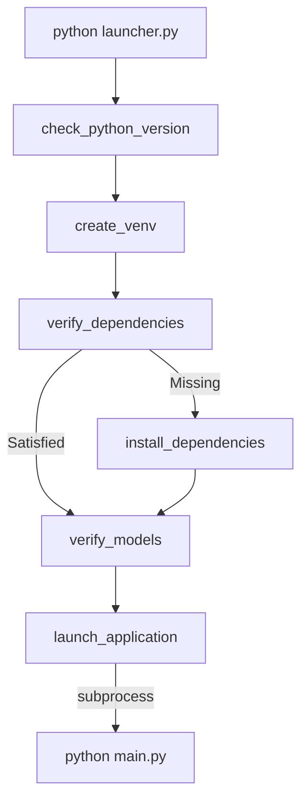

# Architecture Guide

This guide details the high-level design, bootstrap flow, module responsibilities, and configuration management in **Sono-Guide**.

---

## 1. High-Level Architecture

Sono-Guide uses a decoupled architecture to separate concerns, making setup, configuration, UI rendering, and AI inference clean and independent:

```text
               +-----------------------------+
               |         launcher.py         |  <-- CLI Entrance
               +--------------+--------------+
                              |
                              v
               +-----------------------------+
               |      setup/ orchestrator    |  <-- Environment Audit
               +--------------+--------------+
                              | (subprocess)
                              v
               +-----------------------------+
               |           main.py           |  <-- Standalone / Handoff
               +--------------+--------------+
                              |
                              v
               +-----------------------------+
               |            src/             |  <-- Application Domain
               +-----------------------------+
```

---

## 2. Bootstrapping Flow

The bootstrap workflow is divided between `launcher.py` and `main.py` using submodules under `setup/` to isolate platform logic:



1. **Python Checker (`python_checker.py`)**: Asserts compiler interpreter version is `>= 3.10`.
2. **Venv Manager (`venv_manager.py`)**: Resolves virtual environment paths and initializes `.venv` using Python's standard `venv` library.
3. **Dependency Manager (`dependency_manager.py`)**: Audits packages using import and metadata checks. Installs PyTorch CPU from downloading index first, then Ultralytics, and finally remaining lightweight dependencies.
4. **Bootstrap Handler (`bootstrap.py`)**: Checks for critical YOLO model weights (`best.pt`) and launches `main.py` as a subprocess with activated path configurations.

---

## 3. Module Responsibilities

The codebase is organized into cohesive modules:

### Core Entry Points
* **`launcher.py`**: Entry-point orchestrator script.
* **`main.py`**: Initializes Tkinter, boots GUI panels, links the video engine, and configures graceful shutdown behavior.

### Setup Scripts (`setup/`)
* **`dependencies.py`**: Central repository metadata. Parses manifest files (`requirements.txt`, `requirements/ai.txt`) dynamically to extract package names.
* **`python_checker.py` / `venv_manager.py` / `dependency_manager.py` / `bootstrap.py`**: Bootstrapping subcomponents.

### Application Logic (`src/`)
* **`src/utils/config.py`**: Frozen configuration classes defining colors, fonts, margins, limits, and thresholds.
* **`src/utils/paths.py`**: Paths binder referencing config properties.
* **`src/utils/utils.py`**: General file, timestamp, and OpenCV image quality/contrast calculations.
* **`src/ai/ai_detector.py`**: Runs YOLO model inference, pre-processes ultrasound frames, and applies Kalman filtering to smooth bounding box transitions.
* **`src/tracking/stability_tracker.py`**: Extracts motion vectors using Farneback optical flow and manages stability threshold buffers.
* **`src/ui/ui_layout.py`**: Renders GUI windows, handles animations, telemetry HUD canvas gauges, and binds window close events.
* **`src/ui/gallery_manager.py`**: Populates the scrollable sidebar with thumbnails of captured standard planes.
* **`src/video/calibration_monitor.py`**: Analyzes brightness, contrast, speckle noise, and sharpness bounds.
* **`src/video/auto_freeze.py`**: Implements capture cooldowns, frame scoring, and file storage.
* **`src/video/overlay_renderer.py`**: Renders HUD grid systems, heatmaps, target crosses, and compliance watermarks onto the display feed.
* **`src/video/video_engine.py`**: Ingestion thread runner that coordinates frame capture, analysis, UI updates, and panel resizing animations.

---

## 4. Configuration System

Centralized variables are managed in `src/utils/config.py`.
* **Centralization**: Prevents duplicate configurations across UI and video engines.
* **Immutability**: Frozen dataclasses enforce read-only settings (`CONFIG = AppConfig()`).
* **Namespace Isolation**: Grouped into namespaces (e.g. `CONFIG.ui`, `CONFIG.video`, `CONFIG.overlay`).

---

## 5. Execution Flow

1. `main.py` initializes the Tkinter `root` and instantiate `UILayout(root)`.
2. `VideoEngine` is initialized and spawns a background thread running `VideoEngine.run()`.
3. For each frame:
   * VideoEngine gets the frame.
   * `CalibrationMonitor` analyzes brightness/contrast.
   * `AIDetector` runs YOLO inference and Kalman smoothing.
   * `StabilityTracker` updates motion levels and checks lock status.
   * `AutoFreeze` scores frames and saves if locked.
   * `OverlayRenderer` renders HUD lines, text, and alerts.
   * UI callbacks push the updated PhotoImage and telemetry metrics.
   * The panel slides in/out based on stability scores.
